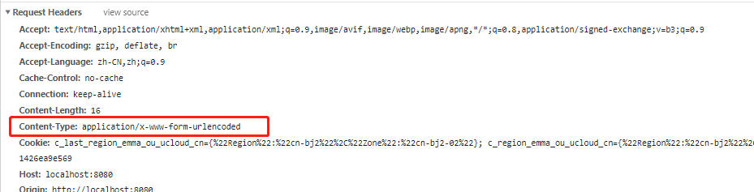
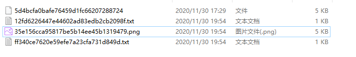

## 前提知识
先看一下，下面这个上传文件失败的例子：
新建 `pre-app.js`文件：
```javascript
const express=require('express');
const bodyParser=require('body-parser');

const app=express();
app.listen(3000,function(err){
  if(!err){
    console.log('server is listening 3000 port');
  }else{
    console.log(err);
  }
});
app.use(bodyParser.urlencoded({extended:false}));
app.post('/',function(req,res){
  console.log(req.body);
});
```
在 `static` 下新建文件 `index.html`：
```html
<!DOCTYPE html>
<html lang="en">
<head>
  <meta charset="UTF-8">
  <meta name="viewport" content="width=device-width, initial-scale=1.0">
  <meta http-equiv="X-UA-Compatible" content="ie=edge">
  <title>Document</title>
</head>
<body>
  <h3>文件上传</h3>
  <form action="/upload" method="POST">
    file:<input type="file" name="file" id="">
    <input type="submit" value="上传">
  </form>
</body>
</html>
```

启动服务器后，访问 [http://localhost:8080/index.html](http://localhost:8080/index.html)，上传一个文件，就可以看到控制台打印的结果：

```
[Object: null prototype] { file_01: 'test.txt' }
```
上传文件失败，只有一个文件的名字，并没有把文件传过来。

### 失败原因
- 第一，form 表单中的 `enctype` 不对；
- 第二，`body-parser` 无法处理文件；


这里解释一下，form 表单中的 `enctype` 有三种：
1. `application/x-www-form-urlencoded`，上传普通值，这个属性值表示会将表单数据用&符号做一个简单的拼接
2. `multipart/form-data`，表示上传实际的文件，不仅仅是值
3. `text/plain`

而 form 表单默认的 `enctype` 值是 `application/x-www-form-urlencoded`，这是刚才上传请求的请求头：



所以要想上传文件，首先要把 form 表单的 `enctype` 设为 ` enctype="multipart/form-data"`

另外， body-parser 也无法处理文件，需要中间件 multer。

```javascript
const bodyParser=require('body-parser');
// 处理表单提交，对应请求头application/x-www-form-urlencoded
app.use(bodyParser.urlencoded({
  extended: false // 为true时将使用qs库处理数据，通常不需要
}))

// 处理fetch请求，对应请求头application/json
app.use(bodyParser.json())
```

## multer 中间件
Express 默认并不处理 HTTP 请求中的数据，对于普通请求体（JSON、二进制、字符串）数据，可以使用 `body-parser` 中间件。而文件上传（`multipart/form-data`请求），可以基于[请求流](https://itbilu.com/nodejs/core/VkK5RCoXW.html)处理，也可以使用 [formidable](https://itbilu.com/nodejs/npm/41vWPhuEb.html) 模块或 `Multer`中间件。

`Multer` 是Express官方推出的，用于 Node.js `multipart/form-data` 请求数据处理的中间件。它基于 [busboy](https://github.com/mscdex/busboy) 构建，可以高效地处理上传文件，但并不处理 `multipart/form-data` 之外的用户请求。

1. 安装
```bash
npm install multer -S
```
2. 引入 `Multer`
```javascript
const multer = require('multer')
```
3. **设置保存路径**
```javascript
const upload = multer({
  dest: './static/upload'
})
```
4. 处理上传文件
```javascript
app.use(upload.any()) // any 表示可以接受任意文件
```   
5. 接收上传结果
```javascript
app.post('/upload', (req, res, next) => {
  console.log(req.files)
})
```

此时启动服务器，再次上传文件，会发现 `./static/upload` 文件夹下多了一个文件，但是这个文件没有后缀，不能正常打开。


如果希望上传来的文件有后缀名，需要用用到 `fs` 模块和 `path` 模块。
```javascript
const express=require('express');
const bodyParser=require('body-parser');
const multer=require('multer');
const fs=require('fs');
const pathLib=require('path');

const app=express();
app.listen(3000,function(err){
  if(!err){
    console.log('server is listening 3000 port');
  }else{
    console.log(err);
  }
});
const upload = multer({
  dest: './static/upload'
})
//any表示可以接受任意文件
app.use(upload.any());
app.post('/',function(req,res){
  console.log()
  //上传的文件在files里
  const newName=req.files[0].path+pathLib.parse(req.files[0].originalname).ext;
  fs.rename(req.files[0].path,newName,function(err){
    if(err){
      res.send(err);
    }else{
      res.send('succeed');
    }
  });
});
```
启动`app.js`，上传结果如下：



