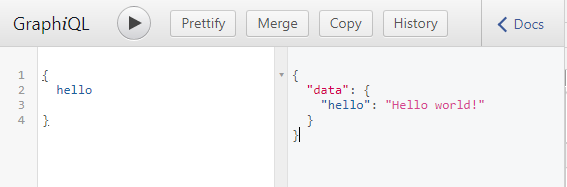
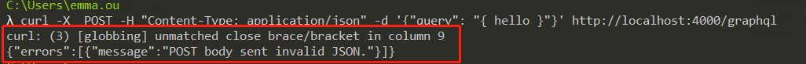

# 如何使用 GraphQL  
## 服务端启动服务
### 1、安装 express、graphql、express-graphql
```bash
npm install express express-graphql graphql -S
```
### 2、启动 GraphQL 服务
创建一个`starter.js`，具体代码见 [starter.js](./starter.js)。

执行 `node starter.js`。

由于给 `graphqlHTTP` 设置了 `graphiql: true`，所以可以在 `http://localhost:4000/graphql` 看到 GraphiQL 工具:



## 客户端 请求
### 1、客户端工具
- [GraphiQL](https://github.com/graphql/graphiql)
- [Insomnia](https://github.com/Kong/insomnia)，是一个跨平台的 REST 客户端，建立在 Electron 之上

### 2、浏览器
打开 [http://localhost:4000/graphql](http://localhost:4000/graphql)，在开发者控制台粘贴：
```javascript
fetch('/graphql', {
  method: 'POST',
  headers: {
    'Content-Type': 'application/json',
    'Accept': 'application/json',
  },
  body: JSON.stringify({query: "{ hello }"})
})
  .then(r => r.json())
  .then(data => console.log('data returned:', data));
```
### 3、curl 
```bash
curl -X POST -H "Content-Type: application/json" -d "{\"query\":\"{hello}\"}" http://localhost:4000/graphql
```
官方文档里写的是：`curl -X  POST -H "Content-Type: application/json" -d '{"query": "{ hello }"}' http://localhost:4000/graphql`，但是我试了会报错:


## 基本类型
大多数情况下，我们只需要使用 schema 语言指定 API 需要的类型，然后作为参数传给 `buildSchema` 函数。
GraphQL schema 语言 支持的标量类型有 `String`、`Int`、 `Float`、`Boolean` 和 `ID`。

默认情况下，每个类型可以为空，也就是所有的标量类型都可以返回 `null`。使用感叹号可以标记一个类型不可为空，如 `String!`表示非空字符串。
如果是数组，就用方括号将对应的类型包起来，如 `[int]` 表示一个整数数组。

这些类型直接映射 JavaScript，所以可以直接返回包含这些的原生 JavaScript 对象。
完整示例见 [basic_type.js](./basic_types.js)
```javascript
const schema = buildSchema(`
type Starship {
  id: ID!
  name: String!
}
type Query {
  quoteOfTheDay: String
  random: Float!
  rollThreeDice: [Int]
  getStarship: Starship!
}
`);
```

## 传递参数
在 schema 语言中定义参数，并自动进行类型检查。每一个参数都必须有名字和数据类型。
比如掷骰子 API `rollDice`，接收一个 `numDice` 表示骰子个数 和 `numSides` 表示每个骰子有多少面（完整示例见[passingArguments](./passingArguments.js)）:
```javascript
const schema = buildSchema(`
type Query {
  rollDice(numDice: Int!, numSides: Int): [Int]
}
`);
```
`rollDice` 解析器如下:
```javascript
const root = {
  rollDice: ({numDice, numSides}) => {
    var output = [];
    for (var i = 0; i < numDice; i++) {
      output.push(1 + Math.floor(Math.random() * (numSides || 6)));
    }
    return output;
  }
};
```

## 对象类型
假如我们需要更多的掷骰子的方法，我们可以实现一个 `RandomDie` 对象来代替：
```javascript
const schema = buildSchema(`
type RandomDie {
  numSides: Int!
  rollOnce: Int!
  roll(numRolls: Int!): [Int]
}

type Query {
  getDie(numSides: Int): RandomDie
}
`);

class RandomDie {
  constructor(numSides) {
    this.numSides = numSides;
  }

  rollOnce() {
    return 1 + Math.floor(Math.random() * this.numSides);
  }

  roll({numRolls}) {
    var output = [];
    for (var i = 0; i < numRolls; i++) {
      output.push(this.rollOnce());
    }
    return output;
  }
}

const root = {
  getDie: ({numSides}) => {
    return new RandomDie(numSides || 6);
  }
}
```
这种定义对象类型的方式通常会比传统的 REST 风格的 API 带来更多的好处。只用一次请求就能获取到所有的信息，而不是一次请求只能获取到一个对象的相关信息，还要请求多次API才能获得其他对象的信息。**不仅节省了带宽、让应用更快，同时也简化了客户端应用的逻辑。**

## 变更和输入类型
当 API 用于修改数据时，把入口端点做为 `Mutation` 而不是 `Query`。

如果有多个接口使用相同的输入参数，可以使用“输入类型”来简化 schema，使用`input` 关键字而不是`type`。
```javascript
const schema = buildSchema(`
input MessageInput {
  content: String,
  author: String
}
type Message {
  id: ID!,
  content: String,
  author: String,
}
type Mutation {
  createMessage(input: MessageInput): Message,
  updateMessage(id: ID!,input: MessageInput): Message
}
type Query {
  getMessage(id:ID!): Message
}
`);
class Message{
  constructor(id, {author, content}){
    this.id = id;
    this.author = author;
    this.content = content;
  }
}
const fakeDatabase = {};
const root = {
  getMessage: ({id}) => {
    if(!fakeDatabase[id]){
      throw new Error('no message with id:' + id);
    }else{
      return new Message(id, fakeDatabase[id]);
    }
  },
  createMessage: ({input}) => {
    const id = require('crypto').randomBytes(10).toString('hex')
    fakeDatabase[id] = input;
    return new Message(id, fakeDatabase[id]);
  },
  updateMessage: ({id, input}) => {
    if(!fakeDatabase[id]){
      throw new Error('no message with id:' + id);
    }else{
      fakeDatabase[id] = input;
      return new Message(id, input)
    }
  }
}
```


