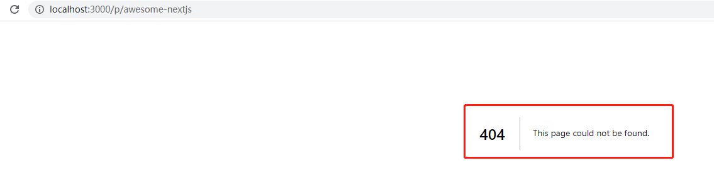
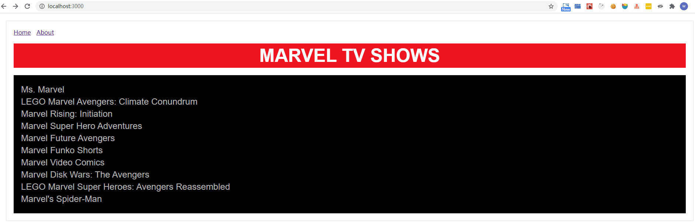
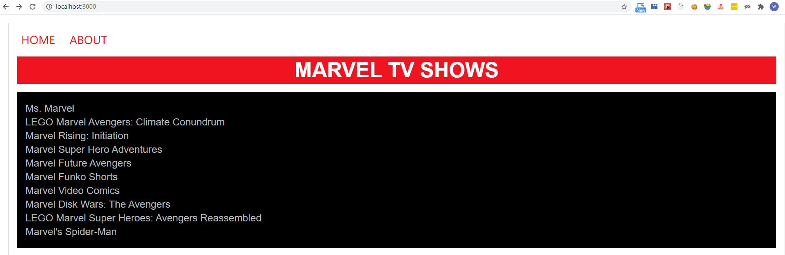

# 基本使用方法
## 初始化项目并安装 next
```bash
npm init -y
npm install react react-dom next -S
# or
yarn add react react-dom next
```
在项目根目录下添加文件夹**pages**,然后在 `package.json` 文件里添加 script 用于启动项目。
```json
"scripts": {
    "dev": "next"
}
```
## 创建视图
在 pages 文件夹下创建 `index.js` 文件：
```javascript
const Index = () => (
  <div>
    <p>Hello next.js</p>
  </div>
)
export default Index
```
## 运行

```bash
npm run dev
```
打开 [http://localhost:3000/](http://localhost:3000/)，看到如下界面：


# 前端路由
再在 pages 文件夹下增加一个 `about.js`:
```
const About = () => (
    <div>
        <p>This is About page</p>
    </div>
)

export default About;
```
当我们在浏览器中请求 [https://localhost:3000/about](https://localhost:3000/about) 时，可以看到页面展示对应内容。

我们可以使用传统的 a 标签在页面之间进行跳转，但每跳转一次，都需要去服务端请求一次。为了增加页面的访问速度，推荐使用 next.js 的前端路由机制进行跳转。
next.js 使用 next/link 实现页面之间的跳转，用法如下：
```javascript
import Link from 'next/link'

const Index = () => (
  <div>
    <Link href="/about">
      <a>About Page</a>
    </Link>
    <p>Hello next.js</p>
  </div>
)

export default Index
```
这样点击index页面的AboutPage链接就能跳转到about页面，而点击浏览器的返回按钮也是通过前端路由进行跳转的。

Link标签支持任意react组件作为其子元素，不一定要用a标签，只要该子元素能响应onClick事件。
```javascript
<Link href="/about">
    <div>Go about page</div>
</Link>
```

# Layout
所谓的 layout 就是就是给不同的页面添加相同的 header，footer，navbar 等通用的部分，同时又不需要写重复的代码。在 next.js 中可以通过共享某些组件实现 layout。

先增加一个公共的header组件，放在根目录的components文件夹下面（页面级的组件放pages中，公共组件放components中）。

然后在index和about页面中引入header组件，这样就实现了公共的layout的header：

```javascript
import Header from '../components/Header';

const Index = () => (
    <div>
        <Header />
        <p>Hello next.js</p>
    </div>
)

export default Index;
```
除了引入多个header、footer组件，我们还可以实现一个整体的Layout组件，避免引入多个组件的麻烦，同样在components中添加一个Layout.js文件：
```javascript
import Header from './Header';

const layoutStyle = {
    margin: 20,
    padding: 20,
    border: '1px solid #DDD'
}

const Layout = (props) => (
    <div style={layoutStyle}>
        <Header />
        {props.children}
    </div>
)

export default Layout
```
这样我们只需要在页面中引入Layout组件就可以达到布局的目的:
```javascript
import Layout from '../components/Layout';

const Index = () => (
    <Layout>
        <p>Hello next.js</p>
    </Layout>
)

export default Index;
```
# 页面间传值

## 1、通过 url 传值（query string）
首先将 `index.js` 的内容替换成如下来展示列表：
```javascript
import Link from 'next/link';
import Layout from '../components/Layout';

const PostLink = (props) => (
    <li>
        <Link href={`/post?title=${props.title}`}>
            <a>{props.title}</a>
        </Link>
    </li>
);

export default () => (
    <Layout>
        <h1>My Blog</h1>
        <ul>
            <PostLink title="Hello next.js" />
            <PostLink title="next.js is awesome" />
            <PostLink title="Deploy apps with Zeit" />
        </ul>
    </Layout>
);
```
通过在 Link 的 href 中添加 title 参数就可以实现传值。

接下来添加博客的详情页 `post.js`：
```javascript
import { withRouter } from 'next/router';
import Layout from '../components/Layout';

const Post = withRouter((props) => (
    <Layout>
        <h1>{props.router.query.title}</h1>
        <p>This is the blog post content.</p>
    </Layout>
));

export default Post;
```

上面代码通过withRouter将next的router作为一个prop注入到component中，实现对url参数的访问。

列表页：


详情页：


## 2、Route Masking
通过 query string 传值，会导致页面的 url 不太简洁美观。所以 next.js 提供了 Route Masking 这个特性用于路由的美化。

所谓的 Route Masking 即让浏览器地址栏显示的url和页面实际访问的url不一样。实现 Route Masking 的方法也很简单，通过Link组件的as属性告诉浏览器href对应显示为什么url就可以了，index.js代码修改如下：
```javascript
import Link from 'next/link';
import Layout from '../components/Layout';

const PostLink = (props) => (
    <li>
        <Link as={`/p/${props.id}`} href={`/post?title=${props.title}`}>
            <a>{props.title}</a>
        </Link>
    </li>
);

export default () => (
    <Layout>
        <h1>My Blog</h1>
        <ul>
            <PostLink id="hello-nextjs" title="Hello next.js" />
            <PostLink id="learn-nextjs" title="next.js is awesome" />
            <PostLink id="deploy-nextjs" title="Deploy apps with Zeit" />
        </ul>
    </Layout>
);
```
运行结果：


Route Masking 对 history 也很友好，点击返回再前进还是能够正常打开页面。**但是如果你刷新详情页，就会报 404**


这是因为刷新页面会直接向服务器请求这个url，而服务端并没有该url对应的页面，所以报错。

为了解决这个问题，需要用到next.js提供的自定义服务接口（custom server API）。

# 3、自定义服务接口
自定义服务接口前我们需要创建服务器，安装Express:
```bash
npm install express -S
```
在项目根目录下创建 `server.js` 文件：
```javascript
const express = require("express");
const next = require("next");

const dev = process.env.NODE_ENV !== "production";
const app = next({ dev });
const handle = app.getRequestHandler();

app
  .prepare()
  .then(() => {
    const server = express();
    server.get("*", (req, res) => {
      return handle(req, res);
    });
    server.listen(3000, (err) => {
      if (err) throw err;
      console.log("> Ready on http://localhost:3000");
    });
  })
  .catch((ex) => {
    console.error(ex.stack);
    process.exit(1);
  });

```


接下来我们需要添加路由将被伪装过的url和真实的url匹配起来，在server.js中添加：
```javascript
.......
const server = express();
server.get('/p/:id', (req, res) => {
    const actualPage = '/post';
    const queryParams = { title: req.params.id };
    app.render(req, res, actualPage, queryParams);
});
......
```

这样就把被伪装过的 url 和真实的 url 映射起来，并且 query 参数也进行了映射。重启项目之后就可以刷新详情页而不会报错了。

# 远程数据获取
next.js 提供了一个标准的获取远程数据的接口: `getInitialProps`，通过 `getInitialProps` 我们可以获取到远程数据并赋值给页面的 props。
`getInitialProps` 即可以用在服务端也可以用在前端。

首先，我们安装 `isomorphic-unfetch`，它是基于fetch实现的一个网络请求库：
```bash
npm install --save isomorphic-unfetch
```
然后修改 `index.js` 如下：

```javascript
import Link from 'next/link';
import Layout from '../components/Layout';
import fetch from 'isomorphic-unfetch';

const Index = (props) => (
    <Layout>
        <h1>Marvel TV Shows</h1>
        <ul>
            {props.shows.map(({ show }) => {
                return (
                    <li key={show.id}>
                        <Link as={`/p/${show.id}`} href={`/post?id=${show.id}`}>
                            <a>{show.name}</a>
                        </Link>
                    </li>
                );
            })}
        </ul>
    </Layout>
);

Index.getInitialProps = async function () {
    const res = await fetch('https://api.tvmaze.com/search/shows?q=marvel');
    const data = await res.json();
    return {
        shows: data
    }
}

export default Index;
```
运行后，展示如下：


接下来实现详情页，首先修改 `server.js` 里 `/p/:id` 的路由：
```javascript
server.get('/p/:id', (req, res) => {
    const actualPage = '/post';
    const queryParams = { id: req.params.id }; // title 改为 id
    app.render(req, res, actualPage, queryParams);
}); 
```
通过 id 作为参数去获取电视节目的详细内容，接下来修改 `post.js`:

```javascript
import fetch from 'isomorphic-unfetch';
import Layout from '../components/Layout';

const Post = (props) => (
    <Layout>
        <h1>{props.show.name}</h1>
        <p>{props.show.summary.replace(/<[/]?p>/g, '')}</p>
        
    </Layout>
);

Post.getInitialProps = async function (context) {
    const { id } = context.query;
    const res = await fetch(`https://api.tvmaze.com/shows/${id}`);
    const show = await res.json();
    return { show };
}

export default Post;
```
重启项目，从列表页进入详情页，展示如下：


# 增加样式
对于React应用，有多种方式可以增加样式。主要分为两种：

- 使用传统CSS文件（包括SASS，PostCSS等）
- 在JS文件中插入CSS

使用传统CSS文件在实际使用中会用到挺多的问题，所以next.js推荐使用第二种方式。next.js内部默认使用styled-jsx框架向js文件中插入CSS。这种方式引入的样式在不同组件之间不会相互影响，甚至父子组件之间都不会相互影响。

## styled-jsx
接下来展示一下如何使用 `styled-jsx`。将 `index.js` 的内容替换成：
```javascript
import Link from 'next/link';
import Layout from '../components/Layout';
import fetch from 'isomorphic-unfetch';

const Index = (props) => (
    <Layout>
        <h1>Marvel TV Shows</h1>
        <ul>
            {props.shows.map(({ show }) => {
                return (
                    <li key={show.id}>
                        <Link as={`/p/${show.id}`} href={`/post?id=${show.id}`}>
                            <a className="show-link">{show.name}</a>
                        </Link>
                    </li>
                );
            })}
        </ul>
        <style jsx>
        {`
            *{
                margin:0;
                padding:0;
            }
            h1,a{
                font-family:'Arial';
            }
            h1{
                margin-top:20px;
                background-color:#EF141F;
                color:#fff;
                font-size:50px;
                line-height:66px;
                text-transform: uppercase;
                text-align:center;
            }    
            ul{
                margin-top:20px;
                padding:20px;
                background-color:#000;
            }
            li{
                list-style:none;
                margin:5px 0;
            }
            a{
                text-decoration:none;
                color:#B4B5B4;
                font-size:24px;
            }
            a:hover{
                opacity:0.6;
            }
        `}
        </style>
    </Layout>
);

Index.getInitialProps = async function () {
    const res = await fetch('https://api.tvmaze.com/search/shows?q=marvel');
    const data = await res.json();
    console.log(`Show data fetched. Count: ${data.length}`);
    return {
        shows: data
    }
}

export default Index;
```
运行之后，首页样式变为：


我们发现导航栏的样式并没有变。因为Header是一个独立的的component，component之间的样式不会相互影响。如果需要为导航增加样式，需要修改Header.js：
```javascript
import Link from 'next/link';

const Header = () => (
    <div>
        <Link href="/">
            <a>Home</a>
        </Link>
        <Link href="/about">
            <a>About</a>
        </Link>
        <style jsx>
            {`
                a{
                    color:#EF141F;
                    font-size:26px;
                    line-height:40px;
                    text-decoration:none;
                    padding:0 10px;
                    text-transform:uppercase;
                }
                a:hover{
                    opacity:0.8;
                }
            `}
        </style>
    </div>
)

export default Header;
```
效果如下：



## 全局样式
当需要添加一些全局的样式，比如rest.css或者鼠标悬浮在a标签上时出现下划线，我们只需要在style-jsx标签上增加global关键词就行了，我们修改Layout.js如下：
```javascript
import Header from './Header';

const layoutStyle = {
    margin: 20,
    padding: 20,
    border: '1px solid #DDD'
}

const Layout = (props) => (
    <div style={layoutStyle}>
        <Header />
        {props.children}
        <style jsx global>
            {`
                a:hover{
                    text-decoration:underline;
                }
            `}
        </style>
    </div>
)

export default Layout
```
这样鼠标悬浮在所有的a标签上时会出现下划线。

# 部署 next.js 应用
## Build
部署之前我们首先需要能为生产环境 build 项目，在 package.json 中添加 script:
```bash
"build": "next build"
```
接下来我们需要能启动项目来serve我们build的内容，在package.json中添加script：
```bash
"start": "next start"
```
依次执行：
```bash
npm run build
npm run start
```
build完成的内容会生成到.next文件夹内，npm run start之后，我们访问的实际上就是.next文件夹的内容。

## 部署并使用自定义服务
通过以上方法虽然能够打包并部署，但是有个问题，我们的自定义服务server.js并没有运行，导致在详情页刷新的时候依然会出现404的错误，所以我们需要把自定义服务加入app的逻辑中。
```bash
# Linux or Mac
"start": "NODE_ENV=production node server.js"
# Window
"start": "set NODE_ENV=production && node server.js"
```
这样我们就解决了自定义服务的部署。重启项目后刷新详情页也能够正常访问了。