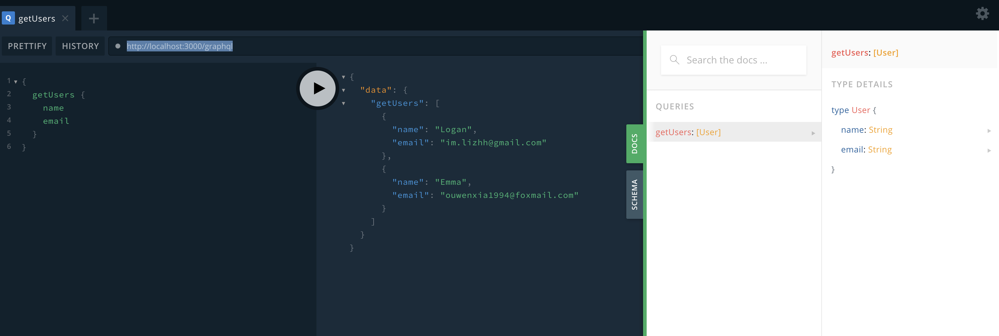

## 使用TypeScript编写GraphQL接口

GraphQL有自己的语言规范，有一定的上手成本，通过[type-graphql](https://typegraphql.com/docs/installation.html)，可以使我们无需学习GraphQL语法去编写Schema，使用TypeScript就可以编写Schema！

### 初始化Express+TypeScript环境

参考[express-typescript-starter](../express-typescript-starter/README.md) 初始化Express+TypeScript环境

### 安装相关依赖

```bash
npm i apollo-server-express graphql type-graphql class-validator -S
# or
yarn add apollo-server-express graphql type-graphql class-validator -S
```

### 安装并引入Reflect Metadata

更多关于Reflect Metadata的介绍，详见[https://jkchao.github.io/typescript-book-chinese/tips/metadata.html#%E5%9F%BA%E7%A1%80]()https://jkchao.github.io/typescript-book-chinese/tips/metadata.html#%E5%9F%BA%E7%A1%80

- 先安装reflect-metadata

```bash
npm i reflect-metadata -S
```

- 在入口文件最顶层引入reflect-metadata（在引入type-graphql及resolver之前）

```ts
// app.ts
import 'reflect-metadata'
```

### 配置typescript

```json
// tsconfig.json
{
  "compilerOptions": {
    "target": "es2018",
    "module": "commonjs",
    "lib": ["es2018", "esnext.asynciterable"],
    "experimentalDecorators": true,
    "emitDecoratorMetadata": true
  }
}
```

### 定义GraphQL Schema

更多更复杂的Schema定义方法，参考[type-graphql官方文档](https://typegraphql.com/docs/types-and-fields.html)

```ts
// app.ts
import { ObjectType, Field } from 'type-graphql'

@ObjectType()
class User {
  @Field()
  name: string

  @Field()
  email: string
}
```


### 定义数据源

此处使用固定数据模拟，真实开发中，数据库、rpc接口、http接口等任何数据源均可作为graphQL的数据提供者

```ts
interface User {
  name: string
  email: string
}

const users: User[] = [
  { name: 'Logan', email: 'im.lizhh@gmail.com' },
  { name: 'Emma', email: 'ouwenxia1994@foxmail.com' }
]
```

### 定义Resolver(解析函数)

参数传递、上下文传递等更多用法，参考[type-graphql官方文档](https://typegraphql.com/docs/resolvers.html)

```ts
import { Resolver, Query } from 'type-graphql'

@Resolver()
class UserResolver {
  @Query(_ => [User])
  async getUsers() {
    return users
  }
}
```

### 创建Apollo服务实例

```ts
import express from 'express'
import { buildSchemaSync } from 'type-graphql'


const PORT = 3000
const app = express()

const apolloServer = new ApolloServer({
  schema: buildSchemaSync({
    resolvers: [ UserResolver ],
  }),
  playground: true,
})

const apolloGraphQLPath = '/graphql'
apolloServer.applyMiddleware({
  app,
  path: apolloGraphQLPath,
})

app.listen(PORT, () => {
  console.log(`server started at http://localhost:${PORT}`)
})
```

### 发送graphQL请求

运行`npm run dev`启动服务后，就可以通过[http://localhost:3000/graphql](http://localhost:3000/graphql)访问GraphQL PlayGround

在左侧描述需要请求的数据类型后，点击中间按钮，右侧就会展示服务端返回数据。

也可以点击页面右侧`DOCS`，查看GraphQL根据Schema自动生成的接口文档


